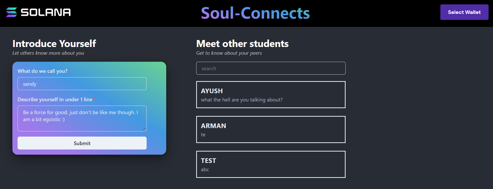

# Introduction
A **Next** based app using **Chakra UI** for styling. 
It is used to send serialized data regarding student introduction to an account over the blockchain

# Description
The program is used to send data to the program running on the solana blockchain. The data is sent in a serialized form as a buffer using BORSH. The transaction is signed by the user by taking use of their browser extension wallets. It currently supports Phantom wallet and can be expanded further to make it accessible for users of other wallet providers such as metamask. 
 
 

 

 

 

